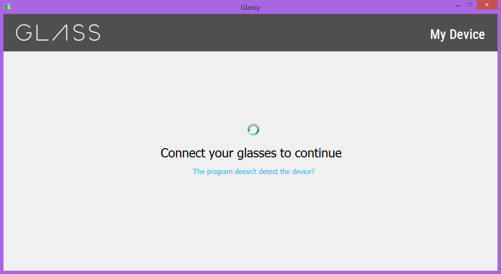
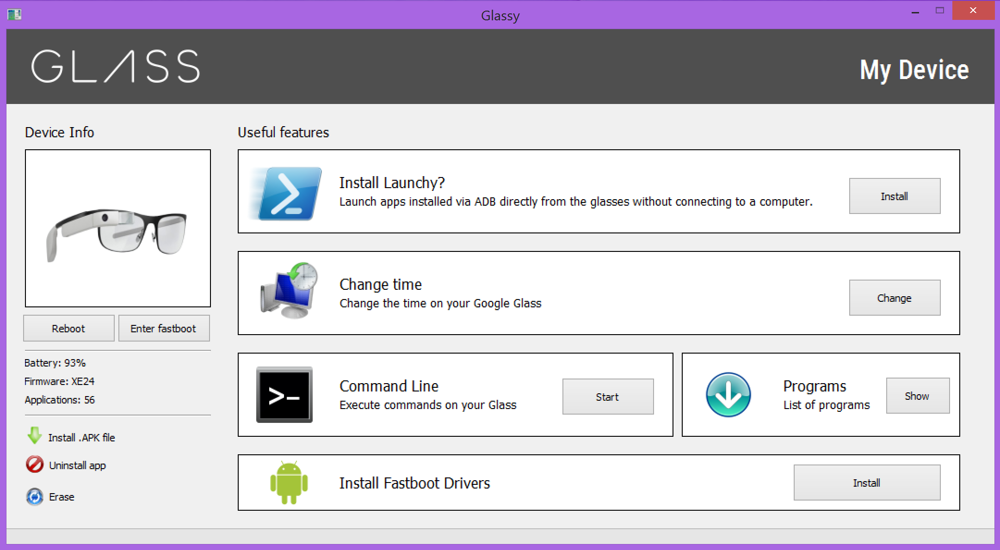

# Glassy
An All-in-One Utility for Google Glass

# Features

* Completely free and open-source
* Super easy installation of Fastboot drivers
* Super easy flashing to XE24 (literally one click)
* Super easy flashing to AOSP 5.1.1 (literally one click)
* Rooting the installed system
* Simple installation of .apk files on Google Glass, as well as easy removal
* Various tweaks (like Launchy to run installed .apk files directly on the glasses)
* Windows 8.1 support

# How to install

Download ``Glassy.exe`` and run it (yes, it's 400 MB because I included the XE24 firmware in the installer).

# How to build

Install these libraries:
* ``PyQt5==5.15.5``
* ``art``

Run the command specified in the ``build.txt`` file.
